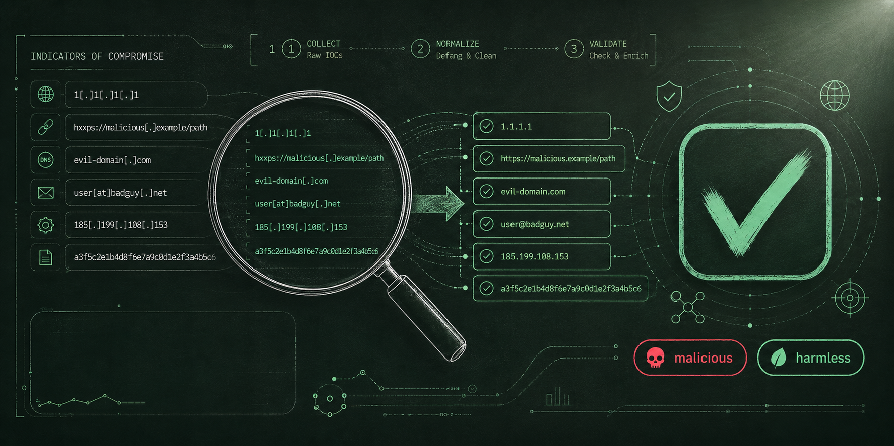
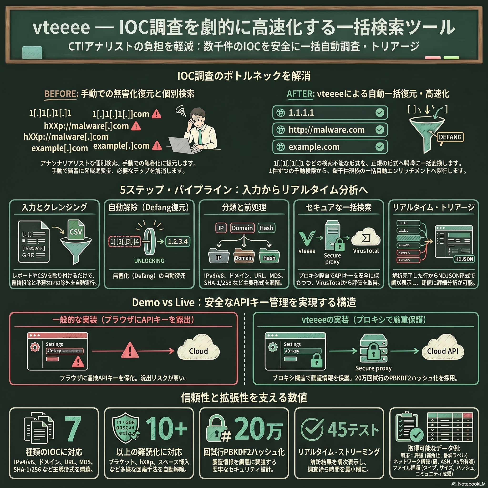
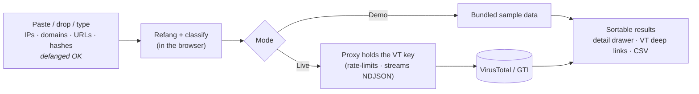

<p align="center">
  
</p>

<p align="center">
  <a href="https://waganawa-megumin.github.io/vteeee/"></a>
  <a href="https://github.com/Waganawa-Megumin/vteeee/actions/workflows/ci.yml"></a>
  
  
  
  
  
  <a href="LICENSE"></a>
  
  <a href="https://ko-fi.com/shonanboyeah"></a>
</p>

<p align="center"><b>Triage a wall of indicators in one paste.</b></p>

**vteeee** is a bulk IOC search tool for CTI analysts. Paste, drop, or type a list of
**IPs, domains, URLs, or file hashes** — even defanged like `1[.]1[.]1[.]1` or
`hxxps://evil[.]com` — and vteeee cleans them up, classifies them, and enriches each one
through the **VirusTotal / Google Threat Intelligence** API. Results stream into a
sortable table with per-row detail and one-click deep links back to virustotal.com.

> 🇯🇵 日本語の概要は[こちら](#日本語概要)。詳しい運用・デプロイ手順は **[docs/GUIDE.ja.md](docs/GUIDE.ja.md)**。

---

## At a glance

<p align="center">
  
</p>
| | |
|---|---|
| **Input** | newline list · CSV · messy pasted text · drag-and-drop file |
| **Indicators** | IPv4 · IPv6 · domain · URL · MD5 · SHA-1 · SHA-256 |
| **De-obfuscation** | `[.] (.) [dot] (dot) \.` · `hxxp/hxxps/fxp` · `[://] [:]` · `[@] (at)` · quotes/markdown/trailing punctuation |
| **Enrichment** | detection ratio · reputation · GTI verdict/severity · ASN/country · registrar/categories · threat label · tags |
| **OSINT (IPs)** | **Shodan** — open ports · running services · known CVEs · org/ISP/OS · hostnames · tags *(set `SHODAN_API_KEY` on the proxy)* |
| **Geolocation (IPs)** | **MaxMind GeoIP** — country/region/city · ISP/ASN · connection type · anonymizer (VPN/Tor/proxy) · **map** *(Insights adds confidence scores, static-IP score, user counts, US demographics)* |
| **Safety** | dedupes; flags & excludes RFC1918 / reserved IPs; never auto-submits unknowns (saves quota) |
| **Modes** | **Demo** (static, sample data) · **Live** (real lookups via a key-holding proxy) |

---

## Why

Analysts lose time pasting indicators into VirusTotal one by one — and most IOCs arrive
**defanged** (`1[.]1[.]1[.]1`, `hxxp://…`) so they can't even be searched as-is. vteeee
turns "a messy block of text from a report" into "a ranked, clickable triage table" in a
single step, while keeping the API key off the browser entirely.

## Features

- **Accurate refang + classify** — 10+ obfuscation styles handled deterministically; IDNs punycoded; duplicates merged.
- **Streaming results** — NDJSON over the wire, so rows appear as they resolve (vital on the free tier's 4 req/min).
- **Analyst-first table** — sort by verdict/detections/reputation, filter, open a detail drawer, export CSV, jump to VirusTotal.
- **GTI-aware** — surfaces `gti_assessment` verdict/severity/threat-score when a GTI key is used (sends the required `x-tool` header).
- **Shodan OSINT** — drop a `SHODAN_API_KEY` on the proxy and every IP row gains open ports, running services, known CVEs and org/ISP/OS context, with a deep link to shodan.io. Key stays server-side; CVEs link out to NVD.
- **MaxMind GeoIP geolocation** — add `MAXMIND_ACCOUNT_ID` + `MAXMIND_LICENSE_KEY` and IP rows gain geolocation (country/region/city/postal), ISP/ASN/domain, connection type and anonymizer (VPN/Tor/proxy) signals, plus an embedded **OpenStreetMap** — no map API key or JS dependency. An **Insights** license also surfaces confidence scores, static-IP score, IP risk, user counts/type and US demographics. Per MaxMind's ToS, coordinates are always shown with the **accuracy radius (km)** and made clear they mark an approximate area, not a precise address.
- **Recorded Future** — set `RECORDEDFUTURE_API_KEY` and every IOC gains a risk score + triggered risk rules & evidence, related threat actors/malware (clickable → on-demand RF profiles), MITRE and AI Insights; hashes get a read-only sandbox summary, and you can pull related **Sigma/YARA/Snort** detection rules. Keys stay server-side; no data is ever submitted to RF.
- **AbuseIPDB** — set `ABUSEIPDB_API_KEY` and every IP gains the community **abuse-confidence score (0–100)**, report/reporter counts, last-reported date, usage type/ISP/domain, Tor/whitelist flags and **attack categories** (SSH, brute-force, port scan, web-app attack, …) with recent reports. Read-only CHECK — nothing is ever reported. AbuseIPDB sends no CORS headers, so the proxy is required (the key stays server-side).
- **IP Monitor dashboard** — ☆ Monitor an IP (or **bulk-register** ticked rows from the results table — one click grabs every IP Shodan has no data on) to register it as a **Shodan network alert** (server-side, so Shodan keeps watching it for changes), and vteeee saves that IP's **enrichment snapshot** alongside. Reopen the full-page **📡 IP Monitor** dashboard the next day: a **world map** of the monitored hosts, a **country heatmap (choropleth)** you can filter to any one group ("darker = more IPs"), **by-country** and **top-CVE** breakdowns, roll-up stats (malicious · suspicious · high-abuse), and per-IP intel (verdict · ports · geo · AbuseIPDB score · RF risk) with open-detail / re-enrich / remove — including **bulk remove / re-enrich**, and a **Check** that diffs the current Shodan observation against the baseline (new/closed ports, new CVEs). As the list grows you can sort IPs into **arbitrary named groups** — each group is a collapsible top-level section with its own select-all checkbox (rename / ungroup from the header), and the group labels sync with the shared watchlist. **Shared by default** (Live mode): the watchlist + snapshots sync via the proxy KV so the whole team sees the same monitored IPs + intel and nobody re-enriches what's already looked up (toggle off in Settings for browser-only). Re-checking a monitored IP refreshes and re-shares its snapshot automatically — whether you use the dashboard's **Re-enrich/Check** or simply **re-run it through the main search** (from any device). Re-enrich no longer throws the past away: every state change is kept as a point-in-time snapshot, and **📈 Analysis** opens a full **Enrichment Analysis** page for that IP — **trends** (sparklines + delta for detections/abuse/RF/ports/CVEs), a **metrics-over-time matrix** with change highlighting, an **A↔B field-level compare** of any two snapshots (grouped by VirusTotal/GTI/AbuseIPDB/Shodan/RF/Geo), and a **timeline** with per-point "vs previous" diffs and Open-any-snapshot. To keep the log from exploding, older points are **age-downsampled** (recent week ≈ daily, then progressively thinned to monthly). Optionally flip **⚡ Auto** (per-IP or bulk) to **auto re-enrich**: a **server-side daily** job (Cloudflare Cron on the proxy — or an external cron POSTing `/api/cron/auto-enrich` on the Node proxy) re-enriches every opted-in IP once a day, saves a fresh snapshot and distributes it to all clients **even when no browser is open** — plus a client-side pass (cadence widening with age) while vteeee is open. Redeploy the proxy to activate the cron. Each IP-Mon row also shows a **trend sparkline + "vs previous" diff** at a glance. The whole timeline **travels with the shared watchlist**, so you can see teammates' enrichments too and avoid redundant lookups. Not just a raw Shodan monitor — your triaged intel travels with the watchlist. Uses the Shodan key (membership+); no data leaves the proxy.
- **CP-Mon (Campaign Monitor) dashboard** — track a **threat campaign** as a living set of IOCs, where the *主役* is the **enrichment history & analysis**, not a Shodan watch. Open **🎯 CP-Mon** → register a campaign by name (multiple campaigns, e.g. one per attack cluster) → open a campaign and add **arbitrary IOCs** (IP / domain / URL / hash) under **arbitrary group names**, or — from the main search results — tick rows and **＋ Campaign** to file them straight into a pre-registered campaign. Every IOC carries the same **point-in-time enrichment timeline** as IP-Mon (age-downsampled, `⚡ Auto`, server-side daily cron re-enrich) and its per-row **trend sparklines + "vs previous" diff**, and the campaign page is a real **analytics dashboard** — roll-up stats, by-type / by-country / top-CVE breakdowns and a **Recent changes** feed of what shifted across every IOC's latest snapshot — not a flat list. A **country heatmap (choropleth)** shades the world "darker = more IOCs" and can be filtered to any one group, and up top a **電光掲示板 key-message ticker** — a one-line **Claude-written 総括** of the whole campaign incl. how the enrichment has shifted (情報推移) — scrolls the current picture at a glance (deterministic fallback when Claude isn't configured). **Shared by default** (all-team model via the proxy KV) so nobody re-enriches what a teammate already looked up, and the summary travels with the campaign so the team sees the same headline.
- **urlscan.io "web魚拓" + Live ports** — on-demand, from the detail panel. For **URLs/domains**, `URLSCAN_API_KEY` submits the target to urlscan.io's sandbox and returns a **screenshot, the finally-resolved URL/IP, server ASN, every contacted host and a malicious verdict** — the visit comes from urlscan's infrastructure, so your own egress IP never touches (and tips off) the target. **OPSEC-safe even on the free tier:** scans are **unlisted** (kept out of urlscan's public feed/search), carry **no identifying tag**, and any `public` request is clamped to `unlisted` unless the proxy explicitly allows it. For **IPs**, "📡 Live ports" pulls the current known ports/CVEs free via Shodan **InternetDB** (no key, no active scan), and with a Shodan key can request an on-demand **re-scan** with live status (QUEUE→PROCESSING→DONE) that auto-loads the fresh banners when it finishes. And where an IP serves web ports, **Shodan × urlscan combine**: a "🎣 Web 魚拓" button captures the actual site the IP serves (via urlscan) — so you get a 魚拓 even for a bare IP. This scanner-mediated design keeps hostile infra from seeing you.
- **Optional Claude smart-parse** — pull IOCs out of free-form report prose; the regex engine still has the final say on typing.
- **Shared-credential login + admin** — PBKDF2-gated, `admin`/`user` roles, in-app user & settings management with JSON export/import.
- **Two themes** — a chalkboard dark theme and an off-white light theme, toggled in the top bar.

## Integrations / 連携サービス

The proxy holds each service's API key — the browser never sees them. **VirusTotal is the base
(required);** Shodan and Claude are optional add-ons. The app header shows which are live (read from
the proxy's `/health`), and each optional one is toggled in **Settings**.

| Service | Role | Required? | Proxy env var | Adds |
|---|---|---|---|---|
| **VirusTotal / GTI** | Threat intel (base) | ✅ **required** | `VT_API_KEY` | verdict · detections · reputation · ASN/country · categories · threat label · first/last seen (files/URLs) · GTI verdict/severity/score |
| **Shodan** | OSINT — IPs | optional | `SHODAN_API_KEY` | open ports · services · known CVEs · org/ISP/OS · hostnames · tags. Plus **📡 Live ports** (detail panel, on demand): current known ports/CVEs via free **InternetDB** (no key, no active scan); with a key, request an on-demand **re-scan** + refresh host banners |
| **MaxMind GeoIP** | Geolocation — IPs | optional | `MAXMIND_ACCOUNT_ID` + `MAXMIND_LICENSE_KEY` | geolocation (country/region/city/postal) · ISP/org/ASN/domain · connection type · **anonymizer (VPN/Tor/proxy)** · embedded **OpenStreetMap**. **Insights** license adds confidence scores · static-IP score · IP risk · user count/type · US avg-income/pop-density. ⚠ Coordinates always shown with the **accuracy radius (km)** as an approximate area (MaxMind ToS) |
| **DomainTools Iris** | Domain/IP intel | optional | `DOMAINTOOLS_API_USERNAME` + `DOMAINTOOLS_API_KEY` | **domains** (Iris Enrich): risk score+components · WHOIS/RDAP · IP/ASN · NS · MX · SSL · website · first seen · tags. **IPs** (Iris Investigate reverse): domains hosted on the IP |
| **DNSLytics** | IP/domain intel | optional | `DNSLYTICS_API_KEY` | **IPs** (IPInfo): ASN · org · network · reverse DNS · hosted-domain count + sample · blocklist. **domains** (HostingHistory): A/AAAA · NS · MX · SPF history |
| **Intel 471 (Titan)** | CTI — all IOC types | optional | `INTEL471_API_USER` + `INTEL471_API_KEY` | **IOC search** (any type): active window · ISP · linked reports/actors · **malware family**. Click the malware-family chip for on-demand family details (malware reports · aka · MITRE · GIR + deep link to the Titan malware page). Plus a **Global Search** button (cross-entity counts: reports/posts/actors/events/credentials/data-leaks) |
| **CYFIRMA (DeCYFIR)** | CTI — all IOC types | optional | `CYFIRMA_API_KEY` | **Risk Dossier** (any type): risk + external-threat scores · recommended action · ASN/org/country · correlated infrastructure (attack-infra side) — merged with the **STIX 2.1 IOC search** for threat-actor/campaign/malware attribution. Click a threat-actor chip for an on-demand **broad search** (that actor's campaigns/malware/targeted CVEs) |
| **TeamT5 ThreatVision** | CTI — all IOC types | optional | `THREATVISION_CLIENT_ID` + `THREATVISION_CLIENT_SECRET` | APT-attribution CTI. **IP/domain**: risk · **adversary (APT) groups** · attributes (Malware C2 / Hosting) · geo/registrar · related-intel counts (**1 AAP each**). **Hash**: adversary + malware family + risk via samples search (**0 AAP**). Click an adversary chip for that APT's aliases/origin/targets. Upload endpoints intentionally not wired |
| **Recorded Future** | CTI — all IOC types | optional | `RECORDEDFUTURE_API_KEY` | **Connect API** (any type): risk score (0-99) · triggered risk rules + **evidence** · activity window · threat lists · **related threat actors/malware** · MITRE · AI Insights · Intelligence Card link. Click an actor/malware chip for its **on-demand profile** (Threat / Connect API). **Hash**: "Sandbox intel" (Malware Intelligence, **read-only** — nothing is submitted). "Detection rules" searches related **Sigma / YARA / Snort** rules (Detection Rule API) |
| **AbuseIPDB** | Reputation — IPs | optional | `ABUSEIPDB_API_KEY` | Community **abuse-confidence score (0–100)** · report/reporter counts · last-reported · usage type · ISP · domain · **Tor / whitelist** flags · **attack categories** (SSH, brute-force, port scan, web-app attack, …) + recent reports, with a deep link to abuseipdb.com. Read-only CHECK (no reporting/POST) |
| **Claude (Anthropic)** | Smart-parse | optional | `ANTHROPIC_API_KEY` | extract IOCs from free-form report prose |
| **SOC Prime (TDM)** | Detection content | optional | `SOCPRIME_API_KEY` | Not per-IOC enrichment. **Detection-rule search** (header **“Rules”**): find SOC Prime Sigma rules by keyword / ATT&CK actor / tool / technique / severity, translated into your SIEM (Splunk/Sentinel/QRadar/Elastic/CrowdStrike/…). Plus a **Results → “SIEM query”** action that turns the shown IOCs into a hunting query via Uncoder AI. Bridges triage → hunting |
| **urlscan.io** | Live capture — URL/domain (on demand) | optional | `URLSCAN_API_KEY` | **"🎣 魚拓" button**: submits the URL/domain to urlscan.io's **sandbox** (the visit originates there, not from your proxy/egress) and returns a **screenshot** · final URL · resolved IP · server ASN/country · HTTP status · **malicious verdict/score** · impersonated brands · every contacted domain/IP · link to the urlscan result. **OPSEC by default** (works on the free tier): submissions are **`unlisted`** (not in urlscan's public feed/search), **no identifying tag** is attached (tags are searchable → would cluster your scans), and `public` is **clamped to `unlisted`** unless `URLSCAN_ALLOW_PUBLIC=true` on the proxy. Because the submit goes via the proxy, the recorded submitter country is the proxy's, not yours |

**Enrichment routes by IOC type:** domain → VT + DomainTools (Enrich) + DNSLytics (HostingHistory) · IP → VT + Shodan + MaxMind (geo/map) + AbuseIPDB (abuse score) + DNSLytics (IPInfo) + DomainTools (reverse) · URL → host treated as a domain · hash → VT + ThreatVision (sample attribution). **Intel 471, CYFIRMA, ThreatVision and Recorded Future apply to every type.** **On-demand live capture (detail panel, not part of batch enrich):** URL/domain → **urlscan.io 魚拓** · IP → **📡 Live ports** (InternetDB / Shodan re-scan with live status) **＋ 🎣 Web 魚拓** for the site a web-facing IP serves (Shodan ports × urlscan). Each optional service toggles independently in **Settings**.

**Enable an optional service — 3 steps:**
1. Add the env var above as a **repo secret** (GitHub → Settings → Secrets) or a proxy env var.
2. Run the **“Deploy Proxy” workflow** (Cloudflare) or restart the Node proxy — this pushes the secret.
3. Reload the app; the header chip flips **ON**. Verify at `<proxy>/health` → `{"vtKey":true,"claude":…,"shodan":…}`.

Turn Shodan lookups off per run in **Settings → Shodan OSINT enrichment** to save Shodan credits even
when the key is present. Step-by-step (GitHub Secrets / Cloudflare / Node): **[docs/GUIDE.ja.md](docs/GUIDE.ja.md)**.

## Live demo

▶︎ **https://waganawa-megumin.github.io/vteeee/**

The public site is a **demo** (bundled sample data — no key, nothing sensitive).
Sign in with the shared demo credentials (**not published here** — provided separately),
then **Load sample → Parse → Enrich**. Point it at your own proxy in **Settings** to go live.

## How it works



A static site can't safely hold a VirusTotal key, and VT's API sends no CORS headers — so
the **key lives only on a small server-side proxy**. The same github.io bundle stays a demo
by default; configuring a proxy URL (in-app, persisted locally) flips it to live with no rebuild.

## Quick start

```bash
pnpm install
pnpm dev        # http://localhost:5173  (demo — no keys needed)
```

### Live mode locally

```bash
cp proxy/node/.dev.vars.example proxy/node/.dev.vars   # set VT_API_KEY, ACCESS_TOKEN, ADMIN_TOKEN
pnpm proxy      # Express proxy on http://localhost:8787
```

Then in the app's **Settings**: set the proxy URL to `http://localhost:8787` and your
`ACCESS_TOKEN`. The badge flips to **LIVE**.

## Deploy

- **Web → GitHub Pages** (`pages.yml`): builds with `VITE_BASE=/vteeee/` and publishes the demo. No secrets injected, so the public site stays a demo.
- **Proxy → Cloudflare Workers** (`proxy-deploy.yml`, recommended): holds `VT_API_KEY` (+ optional `ANTHROPIC_API_KEY`, `SHODAN_API_KEY`) and `ACCESS_TOKEN`/`ADMIN_TOKEN`, with a KV store for shared users/settings. A Node/Express variant is included for self-hosting.

Full, click-by-click instructions (GitHub Secrets, Cloudflare token, KV, connecting the app):
**[docs/GUIDE.ja.md](docs/GUIDE.ja.md)**.

## Security model

- The **VT API key never reaches the browser** — only the proxy holds it (env / GitHub Secrets).
- The github.io login is an intentionally **soft, client-side gate** (shared credential, PBKDF2-hashed — no plaintext). Real protection is the proxy's **access token** (`/api/*`) and **admin token** (`/api/admin/*`) plus a strict CORS allowlist.
- Never commit plaintext passwords or tokens. `users.json` holds hashes only.

## Project layout

```
shared/            defang/classify/extract · VT links + normalizer · PBKDF2  (browser + proxy)
web/               Vite + React static SPA — input, parse preview, results, detail, login, admin
proxy/shared-handler  rate limiting · NDJSON enrich · Shodan · MaxMind · Recorded Future · Claude parse · users/settings store
proxy/node         Express adapter (local / self-host)
proxy/cloudflare   Worker adapter (recommended deploy) + wrangler.toml
.github/workflows  ci · pages · proxy-deploy
```

## Tech & quality

TypeScript (strict) · React + Vite · Zustand · Cloudflare Workers / Express · Vitest.
**113 unit/integration tests** cover the refang/classifier, VT id+link helpers, the response
normalizer, PBKDF2, every provider mapper (Shodan, MaxMind GeoIP, DomainTools, DNSLytics, Intel 471,
CYFIRMA, ThreatVision, SOC Prime, Recorded Future), the enrich orchestration (rate-limit, 429 retry, NDJSON streaming),
the daily-quota/model guards, KV history, and the end-to-end demo path. `pnpm -r typecheck && pnpm -r test`.

## Limitations

- Static-site login/roles are bypassable by design — the proxy tokens + CORS are the real guard.
- Free VT tier is small (~4 req/min, 500/day, non-commercial); keep RPM low. GTI keys are higher.
- A single Cloudflare Worker isolate's rate limiter isn't globally shared — use the Node proxy when you need strict global pacing.

---

## 日本語概要

CTIアナリスト向けの **IOC一括検索ツール** です。IP・ドメイン・URL・ハッシュの一覧（改行 / CSV /
レポート本文のコピペ / ファイルのドラッグ&ドロップ）を渡すと、`1[.]1[.]1[.]1` や `hxxps://` などの
**無害化(defang)を高精度に解除・分類**し、**VirusTotal / Google Threat Intelligence** で一括エンリッチ。
判定・検出比・GTI評価・ASN/国・カテゴリ等を**並べ替え可能な一覧**で表示し、行クリックで詳細＆VTへ直リンク。

- 公開版は **github.io の静的デモ**（サンプルデータ／キー不要）。実データ検索は **APIキーをサーバー側に
  持つプロキシ**経由（キーはブラウザに出ません）。
- **Shodan OSINT**：プロキシに `SHODAN_API_KEY` を登録するだけで、IP行に**開放ポート・稼働サービス・既知のCVE**・
  組織/ISP/OS などが自動付与され、詳細パネルに分かりやすく表示（shodan.io へ直リンク、CVEはNVDへリンク）。
- **MaxMind GeoIP 位置情報**：`MAXMIND_ACCOUNT_ID`＋`MAXMIND_LICENSE_KEY` を登録すると、IP行に**地理位置（国/地域/市/郵便番号）・
  ISP/ASN/ドメイン・接続種別・匿名化(VPN/Tor/プロキシ)判定**を付与し、詳細パネルに**地図(OpenStreetMap)**を表示（地図APIキーやJS依存なし）。
  ライセンスが **Insights** なら信頼度スコア・静的IPスコア・IPリスク・ユーザー数/種別・US人口統計まで。※MaxMind規約により、緯度経度は必ず
  **精度半径(km)**と共に表示し、正確な住所ではなく**“おおよその範囲”**である旨を明示します。
- **Recorded Future**：`RECORDEDFUTURE_API_KEY` を登録すると全種別にリスクスコア・発火リスクルール＋根拠・関連アクター/マルウェア（クリックでRFプロフィール取得）・MITRE・AI Insights を付与。ハッシュはサンドボックス評価（読み取りのみ・検体送信なし）、関連する **Sigma/YARA/Snort** ルールも取得可能。
- **AbuseIPDB**：`ABUSEIPDB_API_KEY` を登録すると IP に**悪用信頼度スコア(0-100)**・レポート数/報告者数・最終報告日・用途種別/ISP/ドメイン・**Tor/ホワイトリスト**判定・**攻撃カテゴリ**(SSH/ブルートフォース/ポートスキャン等)と直近レポートを付与。**読み取り専用**（レポート送信なし）。CORS非対応のためプロキシ必須（鍵はサーバ側）。
- **IP Monitor ダッシュボード**：IP詳細の **☆ Monitor**、または**検索結果テーブルからチェックして一括登録**（「No-Shodan IPs」で Shodan に情報が無い IP を一括選択）で、その IP を **Shodan のネットワークアラート（サーバ側）** に登録。さらに vteeee が**エンリッチ結果スナップショット**も保存するので、**フルページの 📡 IP Monitor ダッシュボード**を翌日開くと、監視ホストの**世界地図**・**国別**／**上位CVE**集計・ロールアップ統計（malicious/suspicious/高abuse）＋IPごとの intel（判定・ポート・地域・AbuseIPDBスコア・RFリスク）を確認でき、**一括削除／一括再エンリッチ**、**Check**（監視開始時からの Shodan 変化＝新規/閉じたポート・新規CVE）も可能。**既定で共有**（Liveモード）：監視IPとスナップショットをプロキシKVで共有するので、チーム全員が同じ監視IP＋intelを見られ、再エンリッチによるAPI無駄打ちを防止（Settings でOFF＝このブラウザのみ）。単なる Shodan 監視ではなく、**トリアージした intel が付いて回る**のがポイント（Shodanキー=membership+ 使用・データはプロキシ内）。
- **urlscan.io 魚拓 ＋ ライブポート（オンデマンド）**：詳細パネルのボタンから。**URL/ドメイン**は `URLSCAN_API_KEY` で対象を urlscan.io の**サンドボックスで実際に開いて保全**（スクショ・最終URL・解決IP・サーバASN・接触した全ホスト・悪性判定）。訪問は **urlscan 側から**行われるため**こちらの出口IPは調査対象に晒れません**（既定 unlisted）。**IP**は「📡 Live ports」で無料の **InternetDB**（鍵不要・再スキャンなし）の現在ポート/CVEを即取得、Shodanキーがあれば**オンデマンド再スキャン**＋最新バナー再取得も。いずれもスキャナ経由で、相手インフラに気付かれにくい設計です。
- ログインは共有ID/PASSの簡易ゲート（PBKDF2、平文非保存）＋ admin/user ロールと管理画面。
- テーマは**黒板**と**オフホワイト**を切替可能。
- 詳しい手順（GitHub Secrets・Cloudflare・接続）→ **[docs/GUIDE.ja.md](docs/GUIDE.ja.md)**

---

## Support / 開発を応援

<p>
  <a href="https://ko-fi.com/shonanboyeah"></a>
</p>

If vteeee saves you triage time, you can support development on **[Ko-fi](https://ko-fi.com/shonanboyeah)** ☕
役に立ったら **[Ko-fi](https://ko-fi.com/shonanboyeah)**
## License &amp; AI use

**Proprietary — all rights reserved. © 2026 Waganawa-Megumin.** This is **personal property**, published for viewing only; it is **not** open source. No license is granted: without written permission you may not use, run, host, copy, modify, or redistribute it. See [`LICENSE`](./LICENSE).

**Reserved: AI/LLM training &amp; text-and-data-mining (TDM).** The author does **not** consent to this repository or the hosted site being ingested for AI/ML model training, fine-tuning, evaluation, or TDM. It's declared in a machine-readable way (a legally meaningful reservation under the EU TDM regime, and honoured by many crawlers):

- [`web/public/robots.txt`](./web/public/robots.txt) — disallows GPTBot, Google-Extended, ClaudeBot / anthropic-ai, CCBot, PerplexityBot, Bytespider and other training crawlers.
- `<meta name="robots" content="noai, noimageai">` + `<meta name="tdm-reservation" content="1">` on every page.
- [`/.well-known/tdmrep.json`](./web/public/.well-known/tdmrep.json) — TDM Reservation Protocol opt-out.

> **GitHub Pages note:** crawlers read `robots.txt` from the **domain root** (`https://<user>.github.io/robots.txt`), not from `/vteeee/`. For a site-wide block, copy the same rules into your root `*.github.io` repo's `robots.txt`. No license or signal can *physically* stop scraping of public content — these establish intent and (in the EU) a binding reservation.

---

<sub>Built for analysts. Paste defanged, get answers. </sub>
