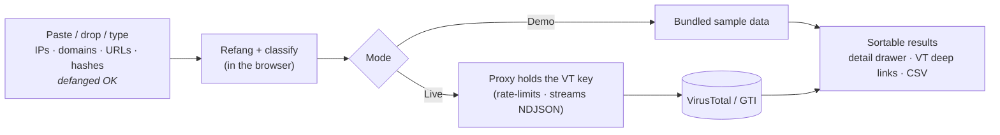

<p align="center">
  
</p>

<p align="center">
  <a href="https://waganawa-megumin.github.io/vteeee/"></a>
  <a href="https://github.com/Waganawa-Megumin/vteeee/actions/workflows/ci.yml"></a>
  
  
  
  
  <a href="LICENSE"></a>
  <a href="https://ko-fi.com/shonanboyeah"></a>
</p>

<p align="center"><b>Triage a wall of indicators in one paste.</b></p>

**vteeee** is a bulk IOC search tool for CTI analysts. Paste, drop, or type a list of
**IPs, domains, URLs, or file hashes** — even defanged like `1[.]1[.]1[.]1` or
`hxxps://evil[.]com` — and vteeee cleans them up, classifies them, and enriches each one
through the **VirusTotal / Google Threat Intelligence** API. Results stream into a
sortable table with per-row detail and one-click deep links back to virustotal.com.

> 🇯🇵 日本語の概要は[こちら](#日本語概要)。詳しい運用・デプロイ手順は **[docs/GUIDE.ja.md](docs/GUIDE.ja.md)**。

---

## At a glance

<p align="center">
  
</p>
| | |
|---|---|
| **Input** | newline list · CSV · messy pasted text · drag-and-drop file |
| **Indicators** | IPv4 · IPv6 · domain · URL · MD5 · SHA-1 · SHA-256 |
| **De-obfuscation** | `[.] (.) [dot] (dot) \.` · `hxxp/hxxps/fxp` · `[://] [:]` · `[@] (at)` · quotes/markdown/trailing punctuation |
| **Enrichment** | detection ratio · reputation · GTI verdict/severity · ASN/country · registrar/categories · threat label · tags |
| **Safety** | dedupes; flags & excludes RFC1918 / reserved IPs; never auto-submits unknowns (saves quota) |
| **Modes** | **Demo** (static, sample data) · **Live** (real lookups via a key-holding proxy) |

---

## Why

Analysts lose time pasting indicators into VirusTotal one by one — and most IOCs arrive
**defanged** (`1[.]1[.]1[.]1`, `hxxp://…`) so they can't even be searched as-is. vteeee
turns "a messy block of text from a report" into "a ranked, clickable triage table" in a
single step, while keeping the API key off the browser entirely.

## Features

- **Accurate refang + classify** — 10+ obfuscation styles handled deterministically; IDNs punycoded; duplicates merged.
- **Streaming results** — NDJSON over the wire, so rows appear as they resolve (vital on the free tier's 4 req/min).
- **Analyst-first table** — sort by verdict/detections/reputation, filter, open a detail drawer, export CSV, jump to VirusTotal.
- **GTI-aware** — surfaces `gti_assessment` verdict/severity/threat-score when a GTI key is used (sends the required `x-tool` header).
- **Optional Claude smart-parse** — pull IOCs out of free-form report prose; the regex engine still has the final say on typing.
- **Shared-credential login + admin** — PBKDF2-gated, `admin`/`viewer` roles, in-app user & settings management with JSON export/import.
- **Two themes** — a chalkboard dark theme and an off-white light theme, toggled in the top bar.

## Live demo

▶︎ **https://waganawa-megumin.github.io/vteeee/**

The public site is a **demo** (bundled sample data — no key, nothing sensitive).
Sign in with `analyst` / `REDACTED` (viewer) or `admin` / `REDACTED`, then
**Load sample → Parse → Enrich**. Point it at your own proxy in **Settings** to go live.

## How it works



A static site can't safely hold a VirusTotal key, and VT's API sends no CORS headers — so
the **key lives only on a small server-side proxy**. The same github.io bundle stays a demo
by default; configuring a proxy URL (in-app, persisted locally) flips it to live with no rebuild.

## Quick start

```bash
pnpm install
pnpm dev        # http://localhost:5173  (demo — no keys needed)
```

### Live mode locally

```bash
cp proxy/node/.dev.vars.example proxy/node/.dev.vars   # set VT_API_KEY, ACCESS_TOKEN, ADMIN_TOKEN
pnpm proxy      # Express proxy on http://localhost:8787
```

Then in the app's **Settings**: set the proxy URL to `http://localhost:8787` and your
`ACCESS_TOKEN`. The badge flips to **LIVE**.

## Deploy

- **Web → GitHub Pages** (`pages.yml`): builds with `VITE_BASE=/vteeee/` and publishes the demo. No secrets injected, so the public site stays a demo.
- **Proxy → Cloudflare Workers** (`proxy-deploy.yml`, recommended): holds `VT_API_KEY` (+ optional `ANTHROPIC_API_KEY`) and `ACCESS_TOKEN`/`ADMIN_TOKEN`, with a KV store for shared users/settings. A Node/Express variant is included for self-hosting.

Full, click-by-click instructions (GitHub Secrets, Cloudflare token, KV, connecting the app):
**[docs/GUIDE.ja.md](docs/GUIDE.ja.md)**.

## Security model

- The **VT API key never reaches the browser** — only the proxy holds it (env / GitHub Secrets).
- The github.io login is an intentionally **soft, client-side gate** (shared credential, PBKDF2-hashed — no plaintext). Real protection is the proxy's **access token** (`/api/*`) and **admin token** (`/api/admin/*`) plus a strict CORS allowlist.
- Never commit plaintext passwords or tokens. `users.json` holds hashes only.

## Project layout

```
shared/            defang/classify/extract · VT links + normalizer · PBKDF2  (browser + proxy)
web/               Vite + React static SPA — input, parse preview, results, detail, login, admin
proxy/shared-handler  rate limiting · NDJSON enrich · Claude parse · users/settings store
proxy/node         Express adapter (local / self-host)
proxy/cloudflare   Worker adapter (recommended deploy) + wrangler.toml
.github/workflows  ci · pages · proxy-deploy
```

## Tech & quality

TypeScript (strict) · React + Vite · Zustand · Cloudflare Workers / Express · Vitest.
**45 unit/integration tests** cover the refang/classifier, VT id+link helpers, the response
normalizer, PBKDF2, the enrich orchestration (rate-limit, 429 retry, NDJSON streaming), and
the end-to-end demo path. `pnpm -r typecheck && pnpm -r test`.

## Limitations

- Static-site login/roles are bypassable by design — the proxy tokens + CORS are the real guard.
- Free VT tier is small (~4 req/min, 500/day, non-commercial); keep RPM low. GTI keys are higher.
- A single Cloudflare Worker isolate's rate limiter isn't globally shared — use the Node proxy when you need strict global pacing.

---

## 日本語概要

CTIアナリスト向けの **IOC一括検索ツール** です。IP・ドメイン・URL・ハッシュの一覧（改行 / CSV /
レポート本文のコピペ / ファイルのドラッグ&ドロップ）を渡すと、`1[.]1[.]1[.]1` や `hxxps://` などの
**無害化(defang)を高精度に解除・分類**し、**VirusTotal / Google Threat Intelligence** で一括エンリッチ。
判定・検出比・GTI評価・ASN/国・カテゴリ等を**並べ替え可能な一覧**で表示し、行クリックで詳細＆VTへ直リンク。

- 公開版は **github.io の静的デモ**（サンプルデータ／キー不要）。実データ検索は **APIキーをサーバー側に
  持つプロキシ**経由（キーはブラウザに出ません）。
- ログインは共有ID/PASSの簡易ゲート（PBKDF2、平文非保存）＋ admin/viewer ロールと管理画面。
- テーマは**黒板**と**オフホワイト**を切替可能。
- 詳しい手順（GitHub Secrets・Cloudflare・接続）→ **[docs/GUIDE.ja.md](docs/GUIDE.ja.md)**

---

## Support / 開発を応援

<p>
  <a href="https://ko-fi.com/shonanboyeah"></a>
</p>

If vteeee saves you triage time, you can support development on **[Ko-fi](https://ko-fi.com/shonanboyeah)** ☕
役に立ったら **[Ko-fi](https://ko-fi.com/shonanboyeah)** で開発を応援いただけると励みになります。

## License

**MIT** — see [LICENSE](./LICENSE). © 2026 Waganawa-Megumin.
<br/><sub>社内・組織の所有物として公開する場合は、著作権者やライセンス種別を適宜変更してください（例: 企業利用なら特許条項のある Apache-2.0 も選択肢）。</sub>

---

<sub>Built for analysts. Paste defanged, get answers. </sub>
