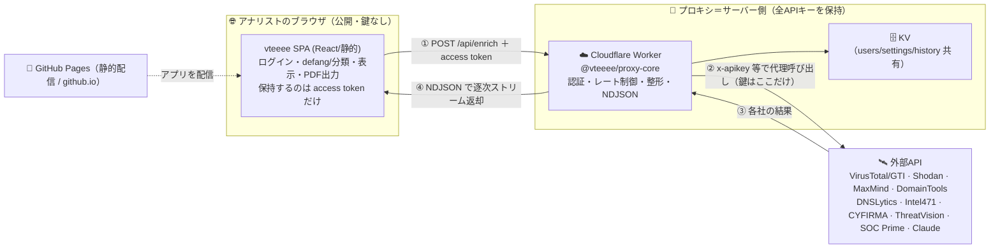
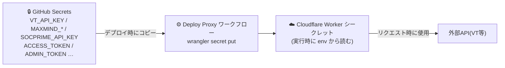
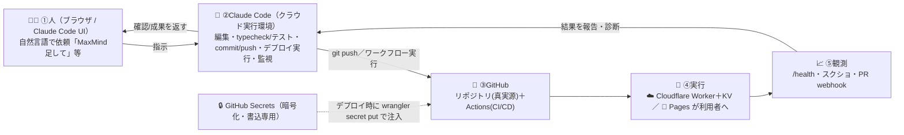
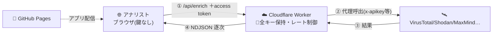

# インフォグラフィックス指示書 — vteeee アーキテクチャ / DevSecOps

**テーマ：Claude × GitHub × Cloudflare が回す DevSecOps — 役割・価値・自動化の輪**

この文書は、vteeee のアーキテクチャを「分かりやすい1枚のインフォグラフィック」に落とすための**制作指示書**です。デザイナーや作図AI（インフォグラフィックス生成）にそのまま渡せます。前半に前提となるアーキテクチャ解説、後半に作図指示（ノード・矢印・配色・コピー）を置いています。

---

## 0. この図で伝えたいこと（主眼）

1. **Claude / GitHub / Cloudflare** それぞれの**役割**と**価値**が一目で分かる。
2. **コード → テスト → デプロイ → 実行 → 観測 → 改善** の**ループが自動で回っている**ことが伝わる。
3. **セキュリティが各工程に織り込まれている**（Sec は独立工程ではなく“横串”）。
4. **「なぜ Cloudflare（プロキシ）が要るのか？」** に3秒で答える。

**キーメッセージ（図の結論・最上部に大きく）**

> **「人はブラウザで“指示するだけ”。Claude Code（クラウド実行環境）が実装〜テスト〜コミット/プッシュ〜デプロイ〜監視までを実行し、GitHubが試して配り、Cloudflareが安全に動かす。」**

> ⚠ 起点は **人の自然言語の指示**であって `git push` ではありません。`git push` や Deploy 実行は **Claude Code が行う“一手”**。ループは「**人 ↔ Claude Code の対話**」で回ります。

---

## 1. アーキテクチャ解説（前提）

### 1.1 ランタイムの全体像

### 1.2 構成要素

| レイヤ | 実体 | 役割 | 鍵の有無 |
|---|---|---|---|
| **ブラウザ** | `web/`（React静的SPA） | ログインゲート、無害化(defang)＋分類、結果表示、PDF/画像出力 | **なし**（access token のみ） |
| **配信** | GitHub Pages | 静的ファイルを配るだけ（サーバー処理なし） | なし |
| **共有ロジック** | `shared/` | defang/分類/正規化/型 をブラウザとプロキシで**共通化**（挙動のズレ防止） | — |
| **プロキシ（頭脳）** | `proxy/shared-handler`（=`@vteeee/proxy-core`） | 認証・レート制御・各社APIへのファンアウト・整形・NDJSON | **全APIキー** |
| **実行環境（既定）** | Cloudflare Worker | 上記コアを載せる無料サーバー＋KV | 保持 |
| **実行環境（代替）** | Node/Express（`proxy/node`） | 自前/オンプレ・**固定IP**が要る時（例：SOC Prime） | 保持 |

### 1.3 2モード

- **Demo（github.io 既定）**：同梱サンプルで動く。鍵もプロキシも不要＝誰でもUI体験可。
- **Live**：Settings に「プロキシURL＋access token」を入れると実データ検索に切替。

### 1.4 ★ なぜ Cloudflare（プロキシ）が必要か — 3つの理由

1. **鍵を隠すため**：github.io は静的サイト＝**JSは誰でも読める**。ここに鍵を置くと盗まれてクォータ悪用される。→ **鍵はサーバー側だけ**に置く。
2. **CORSのため**：VirusTotal API v3 等は **CORSヘッダを返さない**ので、**ブラウザから直接は呼べない**。サーバー経由なら回避できる。
3. **静的ホスティングはサーバーを動かせないため**：Pages は静的専用。だから鍵を持って外部APIを叩く“実行環境”が別に要る。→ **Cloudflare Worker が無料・`wrangler deploy` 一発・Secret管理・KV・CORS制御が容易**。（固定IPが要る用途だけ Node版で代替。）

### 1.5 シークレットの流れ（2ホップ）

APIキーの**登録先は GitHub Secrets**。ただし実行時に読むのは **Cloudflare Worker のシークレット**。

- **① 登録**：各キーを **GitHub Secrets**（暗号化・**書込専用＝後から読めない**・ログでマスク）に入れる。
- **② 配布**：`proxy-deploy.yml` が `printf … | wrangler secret put …` で GitHub Secrets の値を **Cloudflare Worker のシークレット**へ転写。
- **③ 実行**：Worker はリクエストのたびに **Cloudflare 側の env** からキーを読む（GitHubは実行時に見に行かない）。**リポジトリのコードにもブラウザにも入らない**（`.dev.vars` は gitignore）。
- **含意**：Secret を更新したら **Deploy Proxy を再実行**して初めて反映（ローテーション＝Secret更新→Deploy Proxy→反映）。

---

## 2. 3プレイヤーの役割と価値（ヒーロー帯：図の最上段に横並び）

| プレイヤー | 役割（何をする） | 価値（なぜ効くか） |
|---|---|---|
| 🧠 **Claude（Claude Code）** | ①**実行者**：**人の指示を受け、クラウド実行環境から**設計・実装・デバッグ・typecheck/テスト・commit/push・**デプロイ実行**・`/health`監視までを実際に行う。②**実行時機能**：スマートパースでレポート文→IOC抽出（`claude-haiku`） | 人はブラウザで**依頼するだけ**。数倍速で「作る→直す→出す」を回し、属人化せず一貫。**対話で改善ループが回る** |
| 🐙 **GitHub** | **コードの真実源** ＋ **GitHub Actions（CI/CD）** ＋ **暗号化Secrets** ＋ **Pages（静的配信）** | 変更が**自動でテスト＆配布**される“ソフトウェア工場”。全変更が**監査可能な履歴**。鍵はコード外の金庫に安全保管 |
| ☁️ **Cloudflare** | **Worker＝鍵を預かるエッジ実行基盤** ＋ **KV（状態保存）**。CORS回避・レート制御・世界配信 | **サーバー運用ゼロ／自動スケール／無料枠**で鍵を安全に扱える実行基盤。Claude Code の **push／Deploy で本番反映** |

> 各行末に「価値バッジ」：Claude=⚡速い・一貫 / GitHub=🏭自動化・監査可 / Cloudflare=🛡安全・運用ゼロ。

---

## 3. 図の中核：DevSecOps ループ（円環）

**起点は左上の「人（ブラウザで指示）」**。以降を **Claude Code が実行**して時計回りに回す。各ステップに担当アイコンを添える。

- **起点の明示**：ループの入口は **①人の指示**。`git push` や Deploy は **②Claude Code の実行アクション**であり“人の起点”ではない（ここを取り違えないこと）。
- **輪の内側に「🛡 Security is continuous」の帯**（円を横切る）：鍵はサーバー側のみ／Secrets暗号化／テストがゲート／アクセス＆管理トークン／PBKDF2ログイン／PDFのTLP刻印。**「Secは工程ではなく全周に効く」**を明示。
- 各ステップを色分け：**人＝グレー／Claude Code＝青緑(Dev)／Sec＝鍵・盾(琥珀)／Ops＝GitHub・Cloudflare(紫/橙)**。
- **⑤→②の戻り矢印を太く**：「対話で回り続ける」の核心。実例注記（小）＝「例：SOC Prime 403 を観測→Claude Code が User-Agent 修正→再デプロイ→解消」。

---

## 4. 参考ビュー：ランタイムのデータフロー（下段に小さく併記）

**「実行時に鍵を使うのは Cloudflare 側だけ」**を再確認する1本。

---

## 5. 必須コールアウト（各社の“なぜ／価値”を吹き出しで）

- **Claude 🧠**：「**書くだけ**じゃない。**直して・試して・出して・見張る**まで回すAI。だから改善が速い。」
- **GitHub 🐙**：「**押した瞬間に**テストが走り、Webとプロキシへ**自動配布**。鍵は**コード外の金庫(Secrets)**へ。」
- **Cloudflare ☁️**：「**鍵を隠せる無料サーバー**。CORSの壁も越える。**運用ゼロで世界配信**。」
- **なぜ分業か（1枚）**：「静的サイト(github.io)＝安全な受付。**鍵と検索はサーバー(Worker)**。だからブラウザに鍵は出ない。」

---

## 6. ビジュアル・トーン

- **構図**：上＝ヒーロー帯（3社）／中央＝DevSecOpsの輪（主役・最大）／下＝ランタイム1本。**視線は上→中→下**。
- **配色**（アプリ準拠）：地＝ダーク緑 `#243630`／Dev＝ティール `#74d3b1`／Sec＝琥珀 `#f0bb60`／Ops＝紫 `#8b5cf6` ＋ 橙 `#f38020`(Cloudflare)／警告＝珊瑚 `#ff6f86`。明るい版も可（白地＋同アクセント）。
- **アイコン**：Claude=🧠、GitHub=🐙(または公式Octocat)、Cloudflare=☁️(オレンジ)、鍵🔑/金庫🔒、歯車⚙️、ロケット🚀、グラフ📈、盾🛡、衛星🛰。
- **タイポ**：見出し＝太字サンセリフ、コード＝等幅（`git push` `wrangler secret put` `/api/enrich`）。丸数字①〜⑥を大きく。
- **凡例**：担当色（Dev/Sec/Ops）／実線＝自動処理／点線＝デプロイ時のみ／🔑＝鍵あり・🔓＝鍵なし。

---

## 7. そのまま使えるコピー

- **タイトル**：**「対話で回る DevSecOps — 人が指示し、Claude Code が実装〜デプロイ〜監視を実行、GitHub が試して配り、Cloudflare が安全に動かす」**
- **サブ**：「開発者はブラウザで**依頼するだけ**。Claude Code がクラウド実行環境からコード・テスト・`git push`・デプロイ・監視を回す。APIキーはブラウザに出さず、サーバー(Cloudflare)だけが預かる。」
- **締め**：「指示する速さ(人)×実行の速さ(Claude Code)×自動化と監査(GitHub)×安全な実行(Cloudflare)。噛み合って、**安全な改善が対話で回り続ける**。」

---

## 8. Do / Don’t

- **Do**：ループの**起点を「人の指示」**として描く（入口に🧑‍💻）／**人↔Claude Code の双方向矢印**を明示／3社の**価値バッジ**を添える／戻り矢印**⑤→②**を強調（“対話で回る”核心）／Secretsの点線注入を描く／セキュリティは**横串の帯**で表現。
- **Don’t**：**`git push` を“人の起点”として描かない**（起点は人の指示、push は Claude Code の一手）／Sec を単独の1工程にしない（横串で）／ブラウザから外部APIへ直線を引かない（誤解の元＝この図が否定したい絵）／鍵アイコンをブラウザ側に置かない／専門用語を注釈なしで多用しない。

---

## 付録：登場する固有名・ラベル（コピペ用）

- プレイヤー：`Claude` / `GitHub` / `Cloudflare`
- リポジトリ：`web/` `shared/` `proxy/shared-handler (@vteeee/proxy-core)` `proxy/cloudflare` `proxy/node`
- ワークフロー：`pages.yml`（Web配信）`proxy-deploy.yml`（プロキシ＆Secret投入）`ci.yml`（テスト）
- コマンド/ラベル：`git push` `wrangler secret put` `POST /api/enrich` `/health` `NDJSON` `access token` `ADMIN_TOKEN`
- 外部API：VirusTotal/GTI, Shodan, MaxMind, DomainTools, DNSLytics, Intel 471, CYFIRMA, ThreatVision, SOC Prime, Claude(smart-parse)
